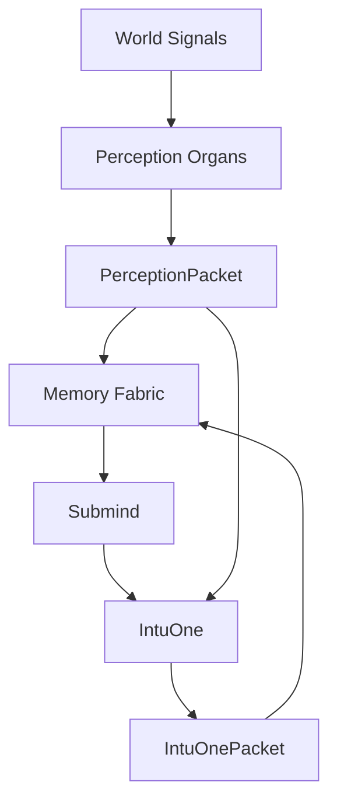

# ParallelLines Engine Design

ParallelLines is a world perception engine. It asks: **how is belief behaving?**

The base model is not a disposable backend. For this lineage, Gemma 4 E4B-it is the intended brain substrate trained by Little Fig into three cognitive cores:

1. Memory Fabric — memory cortex.
2. Submind — parallel subconscious cognition.
3. IntuOne — interpreter cortex.

Internal language is packet-first JSON. Human language comes after valid machine packets.
